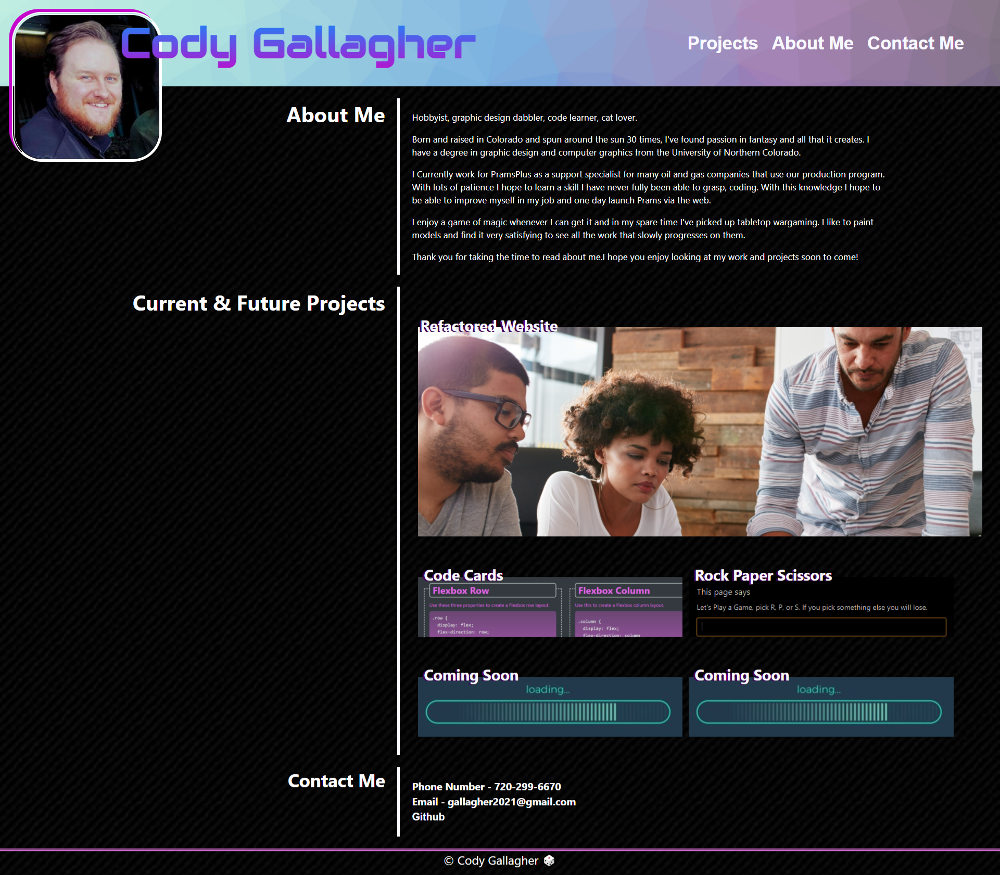

# 02 Advanced CSS Portfolio

Cody Gallagher's portfolio website 2021. 

The purpose of the portfolio is to display projects completed through the DU code boot-camp course.

This portfolio demonstrates HTML and advanced CSS techniques acquired through the first few weeks of class. 

Please take you time and try out the reactive display by resizing the page with the inspect tool in your browser.
Also try hovering over the projects and highlighting some text to see what happenes. 

Below is a screen shot of the portfolio:

Below is a link to the portfolio:

https://codyg-2021.github.io/02-Advanced-CSS-Portfolio/

A note from Cody:

*This was a labor of love and was a eye opener to how much actually goes into creating a fully functional site. It was truly a challenge but I enjoyed working on it as it taught me a lot along the way.*

> **Note**: As of 2-28-2021 certain projects have not been added and will be uploaded in the future. 
